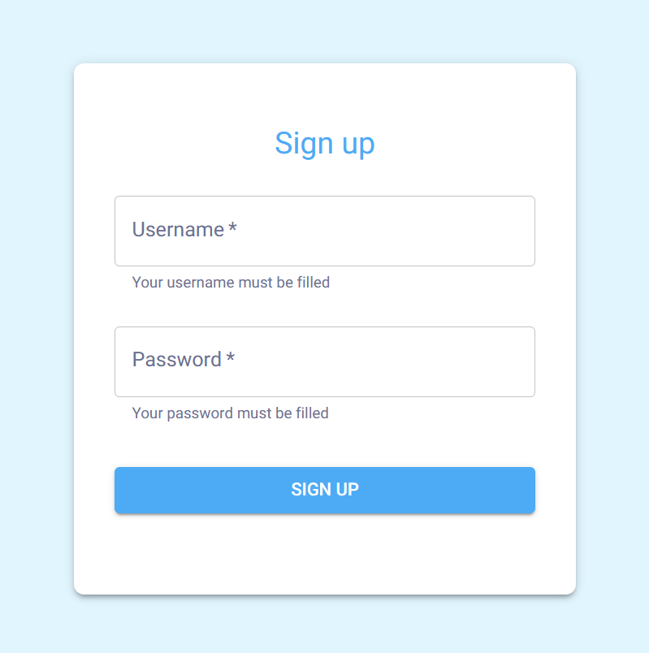
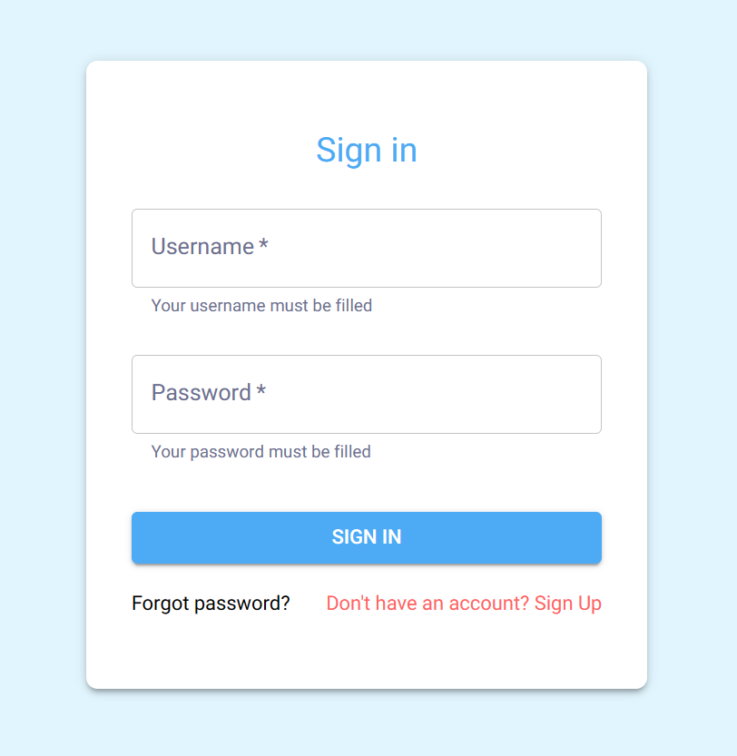
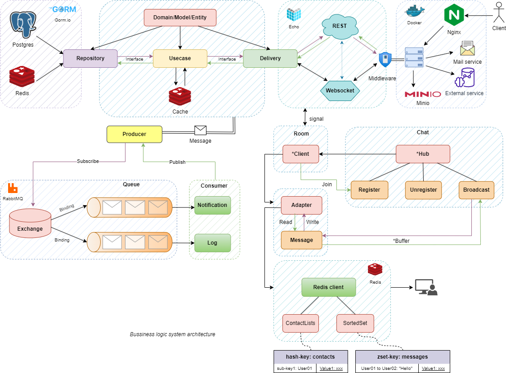
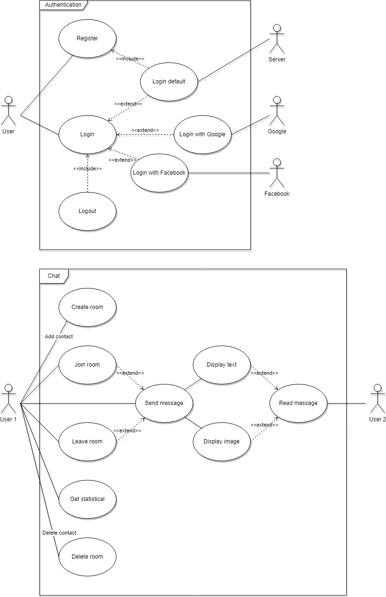

<!-- [](https://github.com/thuongtruong1009/zoomer/actions/workflows/test-and-lint.yaml)
[](https://codecov.io/gh/thuongtruong1009/zoomer)
[](https://goreportcard.com/report/github.com/thuongtruong1009/zoomer) -->

<h1 align="center">ZOOMER</h1>

## Preview

<div>
  
</div>

## **Technologies**

[Swagger for Go](https://github.com/swaggo/swag)

## **What news**

- [x] Support JWT
- [x] Limit rooms per user in a day
- [x] Users can signup and login
- [x] The only way the user can message have to know the receiver user name.
- [x] Users can access their chat history.
- [x] Users can block each other
- [x] Dockerize
- [x] Support Redis cache
- [x] Support Peer connection
- [x] Support Swagger document
- [x] Support file upload/download
- [x] Testing
- [x] Support video call
- [x] Logging
- [x] Send email service
- [ ] Support MessageQueue
- [ ] Support OAuth2
- [ ] Support notification
- [ ] Add role/permission based validation
- [ ] Implement more new features

## Architecture



## Usecase



## **Realtime Chat**

- First, we have the hub running on a separate goroutine which is the central place that manages different channels and contains a map of rooms. The hub has a Register and an Unregister channel to register/unregister clients, and a Broadcast channel that receives a message and broadcasts it out to all the other clients in the same room.

A room is initially empty. Only when a client hits the `/chats/joinRoom` endpoint, that will create a new client object in the room and it will be registered through the hub's Register channel.

Each client has a `writeMessage` and a `readMessage` method. `readMessage` reads the message through the client's websocket connection and send the message to the Broadcast channel in the hub, which will then broadcast the message out to every client in the same room. The `writeMessage` method in each of those clients will write the message to its websocket connection, which will be handled on the frontend side to display the messages accordingly.

## **How to run the code locally**

(Recommend: install [make](https://www.gnu.org/software/make/) before using **make** command - Not required)

##### 1. Clone this repository

##### 2. Update .env file

##### 3. Install dependencies

```console
make setup
```

##### 3. Run the code

- ##### **With local**

```console
make run
```

- ##### **With Docker**

(Requirement: install [docker](https://docs.docker.com/get-docker/))

```console
make docker-dev
```

##### 4. Testing

```console
make tests
```

##### 5. Linting and Formatting

```console
make lint
```

<!-- **References**

- [NATS Grpc](https://github.dev/AleksK1NG/Go-NATS-Streaming-gRPC-PostgreSQL)

- [Goch](https://github.dev/ribice/goch)

- [Ws document](https://www.asyncapi.com/)

- [Email template](https://medium.com/@itsHabib/sending-emails-with-go-using-a-custom-template-ae863b65a859)

- [Mail server config](https://support.google.com/a/answer/9003945?hl=en&sjid=12665133969789364821-AP)

- [Ecommerce](https://github.com/nikhilnarayanan623/ecommerce-gin-clean-arch)
- [Go8](https://github.dev/gmhafiz/go8)

- [Sentinel ip](https://github.dev/oneyottabyte/redis_sentinel)

- [Sentinel auto 1](https://blog.alexseifert.com/2016/11/14/using-redis-sentinel-with-docker-compose/)

- [Sentinel auto 2](https://github.com/helderjnpinto/Redis-Sentinel-Docker-Compose)

- [Status code](https://developer.mozilla.org/en-US/docs/Web/HTTP/Status)

- [Clean architecture 1](https://github.dev/manakuro/golang-clean-architecture)

- [Clean architecture 2](https://github.dev/evrone/go-clean-template)

- [Web socket chat](https://www.youtube.com/watch?v=W9SuX9c40s8)

- [Status user ref](https://anonystick.com/blog-developer/check-user-online-hay-offline-nhu-facebook-voi-1-dong-code-javascript-2020112018731223)

- [V1 ref](https://www.thepolyglotdeveloper.com/2016/12/create-real-time-chat-app-golang-angular-2-websockets/)

- [Chat ref](https://github.com/ong-gtp/go-chat)

- [Redis Cache](https://dev.to/aseemwangoo/using-redis-for-caching-2022-2og5)

- [Sample template](https://github.dev/dzungtran/echo-rest-api)

- [Streaming file with gRPC 1](http://www.inanzzz.com/index.php/post/152g/transferring-files-with-grpc-client-side-streams-using-golang)

- [Streaming file with gRPC 2](https://dev.to/techschoolguru/upload-file-in-chunks-with-client-streaming-grpc-golang-4loc)

- [MinIO uploader](https://dev.to/minhblues/easy-file-uploads-in-go-fiber-with-minio-393c)

- [Goapp template](https://github.com/bnkamalesh/goapp)

- [RabbitMQ docs](https://topdev.vn/blog/ket-noi-amqp-client-voi-rabbitmq-server/)

- [RabbitMQ example 1](https://github.com/lakhinsu/rabbitmq-go-example)

- [Gin template](https://github.com/lakhinsu/gin-boilerplate)

- [Elastic search](https://github.dev/NooBeeID/simple-go-search/tree/develop) -->
